# Visual Time-Series Forecasting
Forecasting time series is crucial for making decisions. Usually people rely on methods that base on past numeric values. Lots of practitioners base their predictions on what they see on charts and plots, often using intuition. Their approach inspired to think about changing direction from only numeric to visual features of time series to make forecasts.

In this project, similarly to what have been presented in this [paper](https://arxiv.org/pdf/2011.09052) from *J. P. Morgan AI Research*, we will be transforming data presenting series of values into images and based on them we will predict the next behavior of a certain value as a subsequent image generated by computer vision model. 

## Project Structure
| File/Dir | Description |
| :--- | :---|
| `train.py` | Main file responsible for model training and plotting charts related to the history of that process |
| `data.py` | Data download, preprocessing, splitting, comparison charts generation, data loaders preparation |
| `metrics.py` | Loss and other metrics |
| `utils.py` | Helper functions used across the project |
| `models.py` | Model architectures |
| `usage.py` | Interface in which user can use the specific model for prediction |
| `research.ipynb` | Handful for rapidly experimenting and testing different new features |
| `visualizations/` | Chart storing directory, contains training history charts, comparison graphs and all other types of plots related to this project |
| `data/` | Storage for reusable data that has been prepared earlier and divided into X and Y |
| `weights/` | Here all model weights will be stored. Dir will be created after first experiment |

## Usage
1. Run following commands to create and activate your environment. After that installation of packages from `requirements.txt` is needed:

    ```sh
    python -m venv venv
    source venv/bin/activate (linux) or ./venv/Scripts/activate (win)
    pip install -r requirements.txt
    ```

2. Go to `data.py` and generate data that you would like to train/test on. Change ticker in `yfinance.download()` method.
3. Prepare model architecture - remember that `train.py` is prepared for encoder-decoder, so if you wanted to test different architecture also change it in file responsible for training.
4. Transition to `train.py`. Then set your desirable parameters and run training. Metrics will be recorded, printed simultaneously to the terminal. When training finishes, new experiment block will be added to `experiments.md` file.

## Data Preparation

### Financial Context
* **Open**: The price at which the asset started trading when the market opened for that specific day.
* **Close**: The final price at which the asset traded when the market closed for the day.
* **High**: The absolute highest price that someone paid for the asset during that single day.
* **Low**: The absolute lowest price reached during that day.
* **Volume**: The total number of units (e.g., shares of stock or total Bitcoins) traded between buyers and sellers during that day.
> We will be using only `Close` column from yahoo finance.

### Data Source
Data has been fetched using `yfinance` library. Assets related to `BTC-USD` were downloaded from period 2016-06-01 -> 2026-06-01 which gave **3652** days and for `^GSPC` from the total beginning to 2026-06-01 which were approximately from after half a year from 1926-06-01, which gave in total about 100 years of data, exactly **24719** days.

### Preprocessing
1. Getting plain time-series values from `yfinance`.
2. Performing *min-max scaling*, so that our values are in range [0...1]. We do this **locally**, getting min and max values that relate to this specific window, not the whole series.
3. Setting desired window length. In our case it is **80**. Window sight limit set to **60**. It means that we will have 80-day length windows in which training data will have zeros from **61** day to the end - **25%** invisible in training examples.
4. Splitting into X and Y and saving (optionally) to `data/` directory for reusability.
5. Comparison graphs are also being plotted to see how data has been transformed and how series which will be splitted into train/val/test in the future will look like in the plot - maybe train data will be to easy and other will have some sudden changes?

### How data look like?
Here are placed a few charts that show how our training and val/test data will look like per each yfinance ticker.

#### BTC-USD

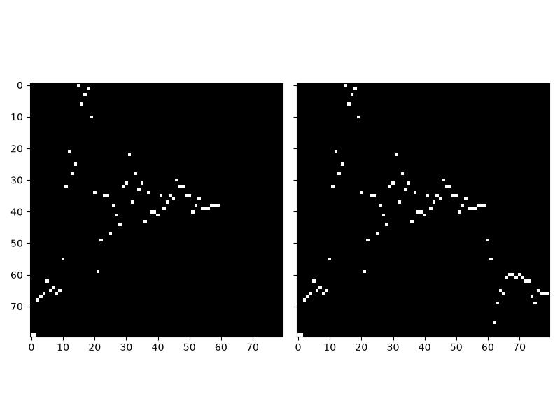

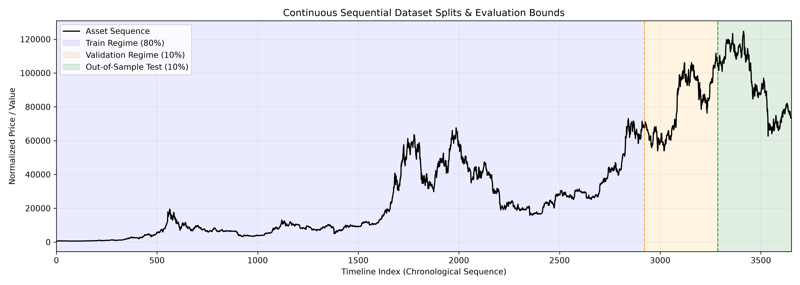

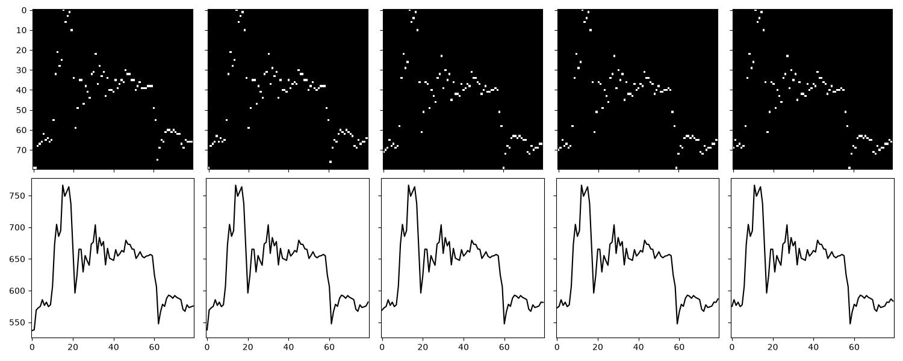

#### ^GSPC
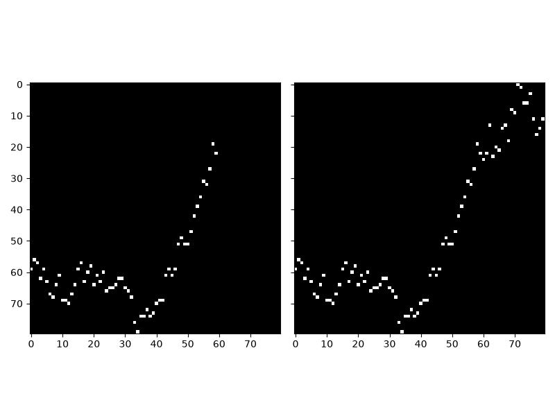

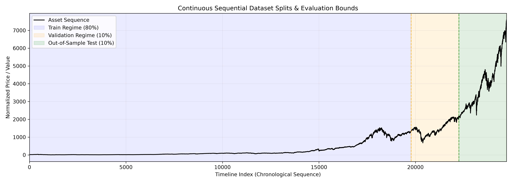

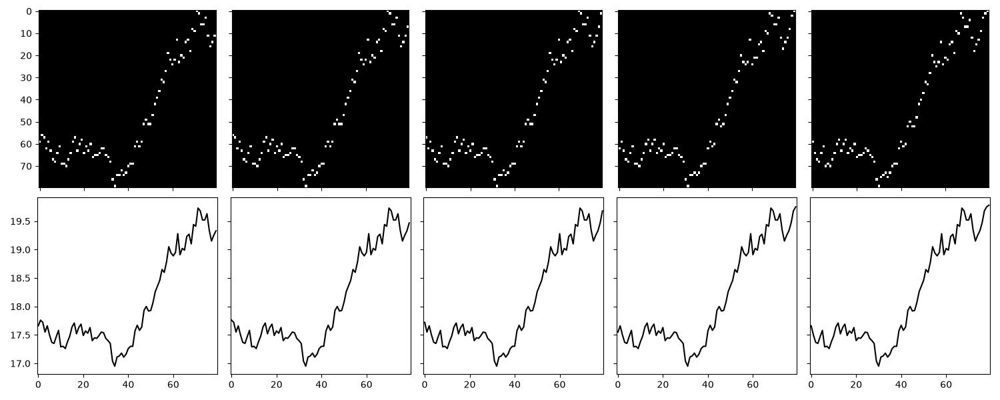

## Model Implementation

### Creating Visual Auto-Encoder
I have created `VisualAE` as a main reusable class that will have `encoder` as well as `decoder` properties which are used in combination, like a function composition $g(f(x))$ where $g$ is our decoder and $f$ is encoder.

Our most frequently used model was the one that was most similar to the model presented in paper. It compresses information in the following way:

$$80 > 40 > 20 > 10 > latent(512) > 10 > 20 > 40 > 80$$

Architecture is depicted below:
```python
class VisualAE(nn.Module):
    def __init__(self, encoder, decoder):
        super().__init__()
        self.encoder = encoder
        self.decoder = decoder
        
    def forward(self, x):
        latent = self.encoder(x)
        output = self.decoder(latent)
        return output

class Encoder(nn.Module):
    def __init__(self, latent_dim=512):
        super().__init__()
        self.conv1 = nn.Conv2d(1, 64, 5, 2, 2)
        self.bn1 = nn.BatchNorm2d(64)
        self.conv2 = nn.Conv2d(64, 128, 5, 2, 2)
        self.bn2 = nn.BatchNorm2d(128)
        self.conv3 = nn.Conv2d(128, 256, 5, 2, 2)
        self.bn3 = nn.BatchNorm2d(256)
        self.relu = nn.ReLU()
        self.flatten = nn.Flatten()
        self.linear = nn.Linear(256 * 10 * 10, latent_dim)

    def forward(self, x):
        x = self.relu(self.bn1(self.conv1(x)))
        x = self.relu(self.bn2(self.conv2(x)))
        x = self.relu(self.bn3(self.conv3(x)))
        x = self.flatten(x)
        x = self.linear(x)
        return x
    
class Decoder(nn.Module):
    def __init__(self, latent_dim=512):
        super().__init__()
        self.linear = nn.Linear(latent_dim, 256 * 10 * 10)
        self.conv1 = nn.ConvTranspose2d(256, 128, 5, 2, 2, 1)
        self.bn1 = nn.BatchNorm2d(128)
        self.conv2 = nn.ConvTranspose2d(128, 64, 5, 2, 2, 1)
        self.bn2 = nn.BatchNorm2d(64)
        self.conv3 = nn.ConvTranspose2d(64, 1, 5, 2, 2, 1)
        self.relu = nn.ReLU()
        self.sigmoid = nn.Sigmoid()
        
    def forward(self, x):
        x = self.linear(x)
        x = x.reshape(x.shape[0], 256, 10, 10)
        x = self.relu(self.bn1(self.conv1(x)))
        x = self.relu(self.bn2(self.conv2(x)))
        x = self.sigmoid(self.conv3(x))
        return x
```

## Metrics

### JSD (loss)
The loss is presented as the sum of column-wise distances $d$ between our true and predicted images:

$$L(y, \hat{y}) = \sum_{i=1}^{w} d(y_i, \hat{y}_i)$$

Where $y$ represents the true ground-truth image and $\hat{y}$ represents the predicted image. The variable $w$ is the image width, and we are summing the distance $d$ of true columns $y_i$ and predicted columns $\hat{y}_i$.

In this case, our distance measure $d$ is the **Jensen-Shannon Divergence**, which is a symmetric and more stable version of the **Kullback-Leibler Divergence**.

---

Instead of using traditional pointwise metrics like Mean Squared Error (MSE), the model frames time-series forecasting as a column-wise probability distribution alignment problem. Each column in the image is treated as a discrete probability distribution where $x$ represents a specific pixel location (price row).

#### 1. Kullback-Leibler Divergence Equation

$$\mathcal{D}_{KL}(P \parallel Q) = \sum P(x) \log \left( \frac{P(x)}{Q(x)} \right)$$

* **$\frac{P(x)}{Q(x)}$ (The Ratio):** This compares the true probability $P(x)$ to the predicted probability $Q(x)$ at pixel $x$. If the network draws the line exactly where it belongs, the ratio becomes $1$, and $\log(1) = 0$, resulting in zero penalty.
* **$P(x) \cdot \log(\dots)$ (The Weighting):** The true chart line acts as a filter. If a pixel is supposed to be empty background ($P(x) = 0$), the entire term becomes $0$. This means the model is never penalized for background pixels and is forced to focus strictly on where the actual line should be drawn.

#### 2. Jensen-Shannon Divergence Equation

$$\mathcal{D}_{JS}(P \parallel Q) = \frac{1}{2} \left( \sum P(x) \log \left( \frac{P(x)}{M(x)} \right) + \sum Q(x) \log \left( \frac{Q(x)}{M(x)} \right) \right)$$

* **$M(x) = \frac{1}{2}(P(x) + Q(x))$ (The Midpoint):** Direct KL divergence breaks mathematically if the network outputs a zero where a line should be (causing division by zero or infinite values). To fix this, both the true distribution $P$ and the predicted distribution $Q$ are compared to their average midpoint, $M(x)$.
* **The Two Sums:** The first sum calculates how far the true chart line deviates from the midpoint, and the second calculates how far the predicted chart line deviates from the midpoint.
* **The $\frac{1}{2}$ Multiplier:** This averages those two directional differences. It smooths out gradients during training and strictly maps the final loss score into a clean error range between $0.0$ (perfect match) and $1.0$ (complete mismatch).

> This is calculated per two independent columns, but in our PyTorch implementation we vectorize and do everything at once across whole batch

## Training

### Configuration
Made using NVIDIA RTX 2060 6B. All trainings were saved in the following files and directories:
* `experiments.md` - all trainings details, what has been changed in specific experiment, parameters, architecture, metrics, charts
* `weights/` - models weights with alignment to specific experiment number
* `visualizations/training/` - place where training charts are stored

`AdamW` with initial **learning rate** equal to 1e-3 and **weight decay** of 1e-4 has been established as our training optimizer.

In addition `ReduceLROnPlateau` scheduler has been used to reduce by multiplicate by 0.1 our learning rate if for 5 epochs there haven't been any improvements.

### Experiments
Starting from simple AE architecture, I was using only **convolutional** layers followed by **relu** activations.

Training process was full of strange situations. Lot of times I faced sudden nans as values of metrics as well as overfitting. I have also faced a few times sudden crashes or jumps in metrics.

#### NaN Problems
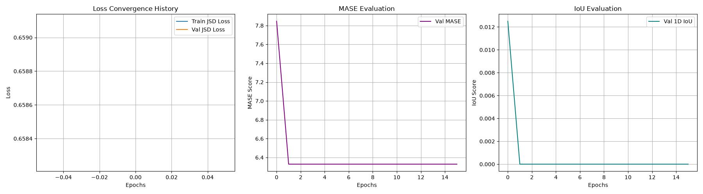

#### Overfitting
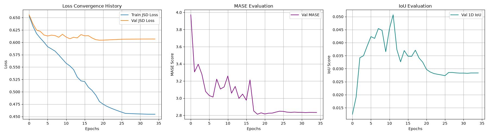

#### Sudden Crash/Jump
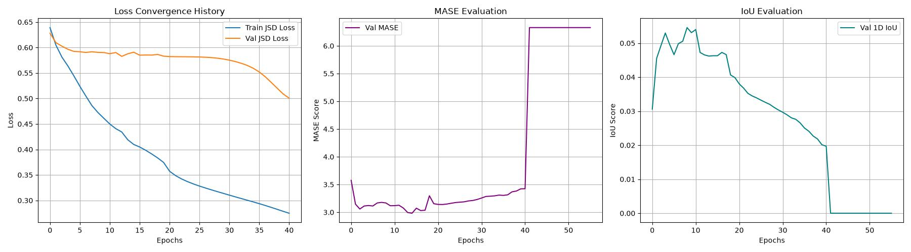

I was constantly changing number of channels inside **convolutional** layers, their **kernel** (3, 5, 7) and **padding** (1, 2) sizes as well as **latent** dimensions and **batch size**. Unfortunately the order order of layer channel sizes didn't matter, so much, maybe because of the fact that that data is really unpredictable, but after some experiments I switched to the best-practice approach in which AEs generally should be constructed - building a pyramid-like structure when it comes to channels. This is because AEs constantly reduce the dimension of images (width), so that we have to increase the channel amount (depth) to balance that process. I have also stayed with papers 128 value as the **batch size** and 512 as **latent** dimension.

**Batch normalization** was crucial in this process. It definitely helped with prevention of sudden crashes in learning and stabilized it, because models with higher parameters also were facing **overfitting**.

In general, Bitcoin is really hard to predict and I couldn't achieve satisfying results on it, so I switched to S&P 500, but in this case the situation was similar.

In addition I have tried on harmonic data generated synthetically similarly as written in paper, but I was disappointed by the results, model weren't learning efficiently and also metrics exploaded. Nevertheless it is imporant to put more time on that in the future.

#### Highest Metrics Achieved
On S&P 500 lower losses were possible to achieve as well as MASE and IoU. Sometimes sudden jsd loss decrement was correlated with higher MASE.

The best IoU scores for Bitcoin validation data were around slightly below ~**0.8**. For MASE is was approximately ~**2.6**. When it comes to validation loss, the lowest values were around ~**0.50**, but almost each time were fluctuating in this range [0.5 ... 0.62].

For S&P 500 there weren't so much experiments conducted as for Bitcoin, but the lowest values for loss were around ~**0.33**, but in such cases MASE metric was rapidly going up. Best values for MASE were close to ~**2.5**, but for IoU ~**0.06**.

## Model in action

### Bitcoin (USD)
#### Train set prediction
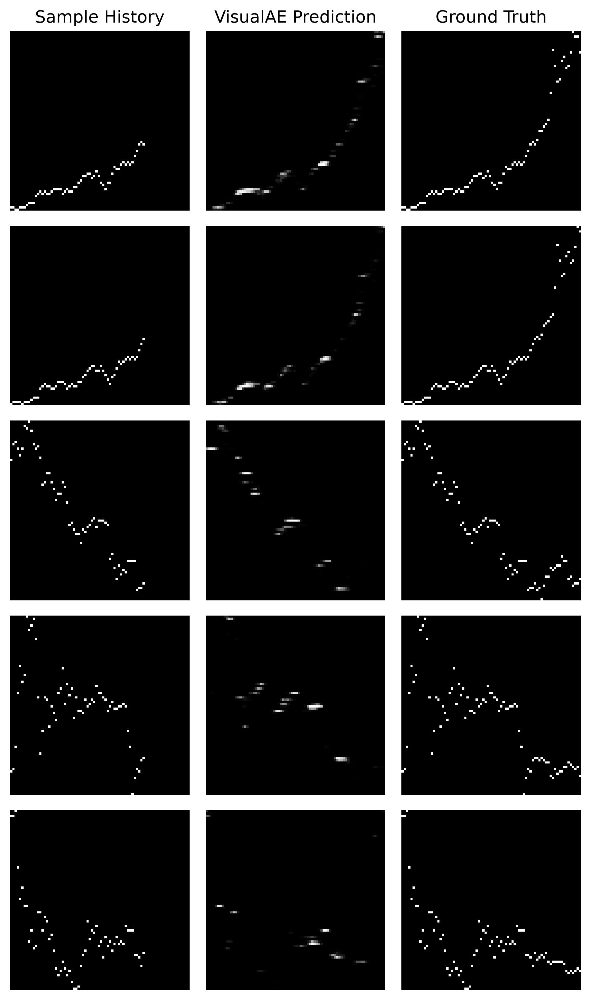
#### Test set prediction
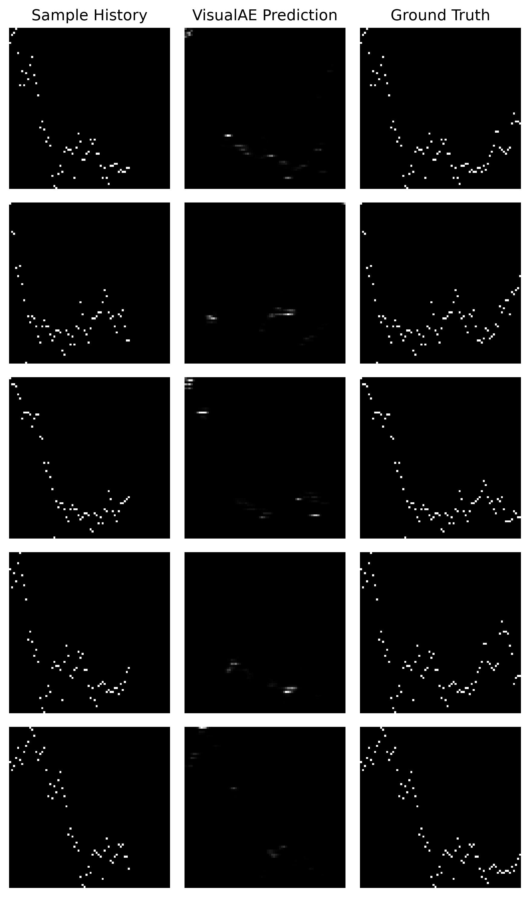

### S&P 500
#### Train set prediction
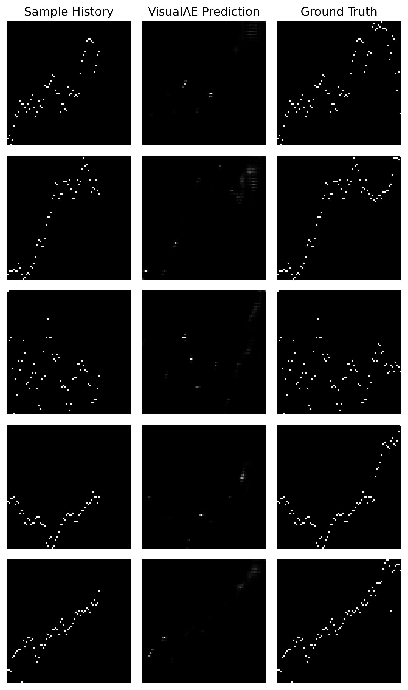
#### Test set prediction
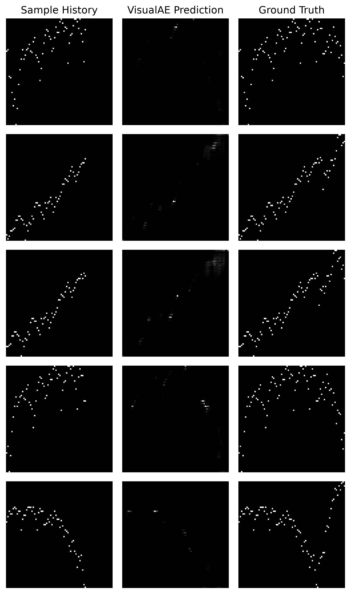

We can see that model in both scenarios slightly tries to draw pixels in correct areas, but still... It is not clever enough. It is probably the case of the enormous difficulty in stock predictions, which are characterized by its high unpredictability.

In the S&P 500 case model couldn't even learn enough to be quite efficient on train set prediction, on data on which it has been trained.

## What could be done in the future?
* More time on understanding more deeply the math
* Usage of other different types of layers in auto-encoder like residual blocks, pooling layers instead of conv transpose
* Maybe don't generate X matrices that have only one 1 in column, do some kind of anti-aliasing, make this matrix more like a line plot
* Other evaluation metrics (ex. SMAPE)
* Compare with numeric models like (ARIMA, numericAE, LSTMs)
* Test on more number of datasets from different domains, synthetic, medical (ECG, like in paper), weather, other financial assets
* Combine different models and modalities, like add car or truck detectors near some crucial areas for market, X posts analysis, audio and emotion prediction on conferences
* Implement WPE metric and show complexity difference across datasets

## Sources
* [Visual Time Series Forecasting: An Image-driven Approach](https://arxiv.org/pdf/2011.09052)
* [The Visual Revolution on Wall Street: Why Quants Are Teaching AI to ‘See’ Markets](https://valeman.medium.com/the-visual-revolution-on-wall-street-why-quants-are-teaching-ai-to-see-markets-ca9d7df4c905)
* [Jensen-Shannon Divergence](https://en.wikipedia.org/wiki/Jensen%E2%80%93Shannon_divergence)
* [Kullback-Leibler Divergence](https://en.wikipedia.org/wiki/Kullback%E2%80%93Leibler_divergence)